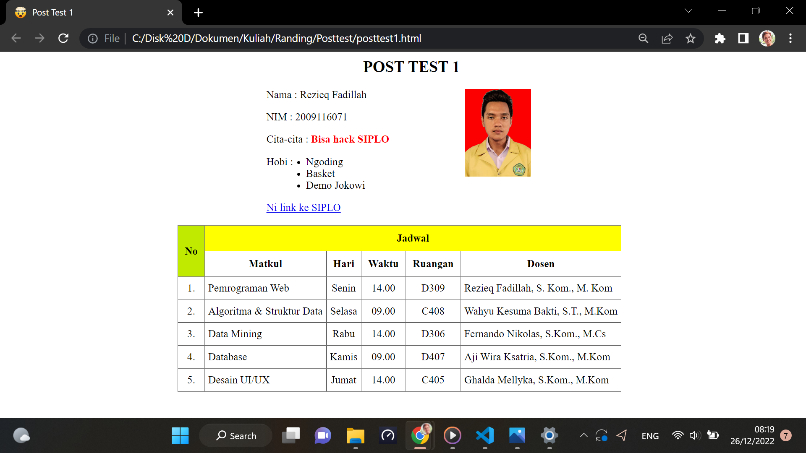

# POST TEST 1

## Target

Dengan selesai mengerjakan post test 1 diharapkan peserta memahami dasar-dasar dari kerangka sebuah website

## Ketentuan

- Buatlah website personalmu menggunakan **HTML**
- Website memuat judul, kemudian data seperti nama, nim, cita-cita, hobi (minimal 3), link ke suatu website, foto, dan tabel
- Tabel mencakup minimal 5 matkul dan memiliki informasi hari, waktu, ruangan dan dosen

Contoh :

*Kerjakan sendiri biar kamu paham, dasar-dasar web ini sangat penting biar kamu tidak bingung saat pertama kali mendengar penjelasan Pak Putut di semester 4 nanti

## Pengumpulan

Jika sudah selesai selanjutnya push projectmu ke GitHub dan kumpulkan link GitHubnya ke https://forms.gle/Wr8cwDXJEZaDeYSx5

